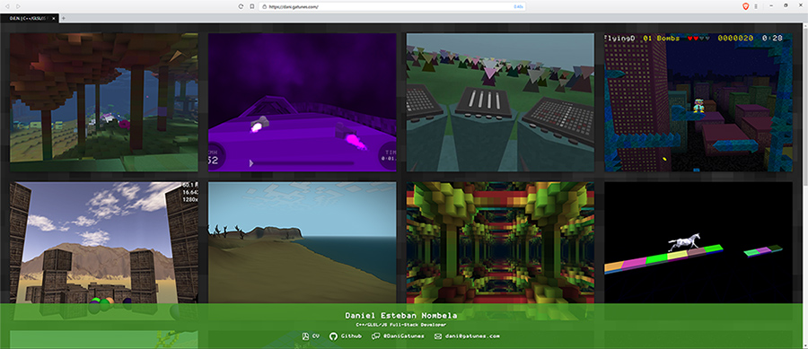

[dani.gatunes.com](https://dani.gatunes.com/)
===

> My personal website/portfolio.

  <!-- Dependency Status -->
  
  <!-- devDependency Status -->
  

---

#### Dev environment

 * yarn install
 * yarn start

#### Production build

 * yarn build

#### Production bundle analyzer

 * yarn build:report

###### Note for MS Windows users:

> Your must have the "Create symbolic links" permission active in your user's Group Policy for the git-hooks to work. You can learn how to do that: [Here](https://superuser.com/a/105381).
