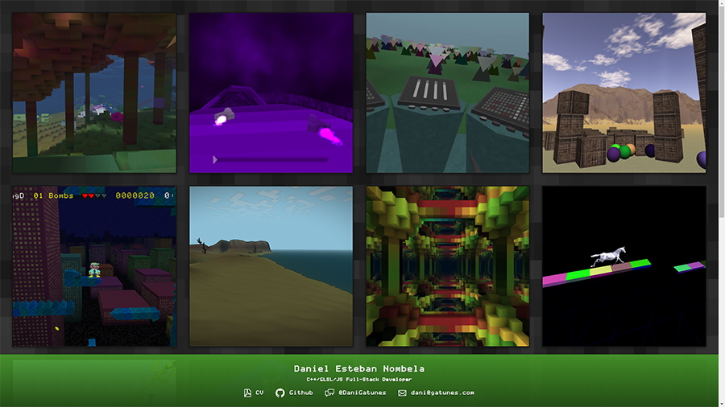

[dani.gatunes.com](https://dani.gatunes.com/)
===

> My personal website/portfolio.

  <!-- Build Status -->
  
  <!-- Dependency Status -->
  
  <!-- devDependency Status -->
  

---

Lately I've been doing a bunch of Vue.js work and I'm starting to love how lightweight and tightly scoped it all is, even for small projects like this... I'm truly considering drifting away from React for good.

As a testament to that sentiment, I wanted to refactor my personal site into Vue in 1 Day. In the process, I ended up making it fully data-driven and it's finally super easy to add/edit projects or even fork a new portfolio for something/someone else.

#### Where's the data?
 * Edit metadata in: [data/meta.json](data/meta.json)
 * Edit projects in: [data/projects.json](data/projects.json)
 * Copy project snapshots into: [data/snapshots/](data/snapshots/)
 * Copy CV into: [data/cv.pdf](data/cv.pdf)

#### How do I start the dev environment?

 * yarn install
 * yarn start

#### Can I analyze the production bundle?

* yarn build:report

#### How do I deploy to github pages?

 * yarn deploy

#### But can you automate that?

 * If you didn't already, Install travis-cli: `gem install travis`
 * Generate a new github personal access token: [Here](https://github.com/settings/tokens)
 * Run `travis encrypt GITHUB_TOKEN=your_gh_access_token` in the project root.
 * Replace the secure env in [.travis.yml](.travis.yml) with the output from travis-cli.
 * Log into [https://travis-ci.org](https://travis-ci.org) and enable your repo.
 * It will build and deploy the bundle to github pages every time you push to master.

#### What if I want to deploy it on my own server?

 * yarn build
 * yarn docker:up

###### Note for MS Windows users:

> Your must have the "Create symbolic links" permission active in your user's Group Policy or the shared-git-hooks module install will fail. You can learn how to fix that: [Here](https://superuser.com/a/105381).
