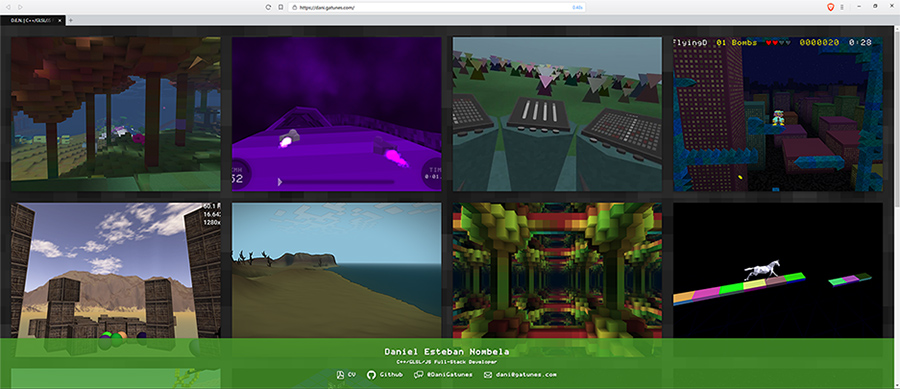

[dani.gatunes.com](https://dani.gatunes.com/)
===

> My personal website/portfolio.

  <!-- Build Status -->
  
  <!-- Dependency Status -->
  
  <!-- devDependency Status -->
  

---

#### Fully data-driven
 * Edit metadata in: [src/data/meta.json](src/data/meta.json)
 * Edit projects in: [src/data/projects.json](src/data/projects.json)
 * Copy project snapshots into: [src/data/snapshots/](src/data/snapshots/)
 * Copy CV into: [src/data/cv.pdf](src/data/cv.pdf)

#### Dev environment

 * yarn install
 * yarn start

#### Deploy to github pages

 * yarn deploy

#### Bundle analyzer

 * yarn build:report

#### Production build

 * yarn build
 * yarn docker:up

###### Note for MS Windows users:

> Your must have the "Create symbolic links" permission active in your user's Group Policy for the git-hooks to work. You can learn how to do that: [Here](https://superuser.com/a/105381).
